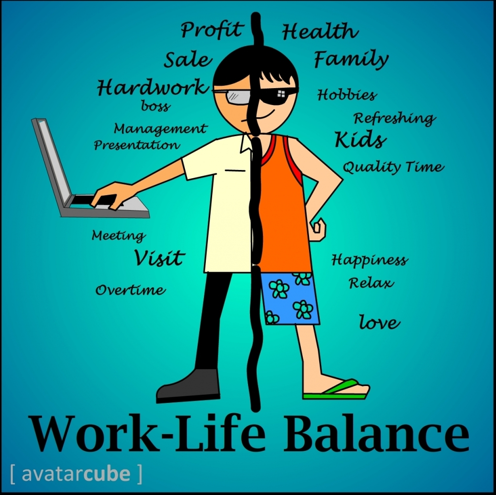

# Developing-insight-into-the-WLB-Work-Life-Balance-of-employees
This exercise involves leveraging SQL to examine a dataset of employee reviews, aiming to address key inquiries regarding the overall quality of life ratings of employees. The objective is to extract valuable insights from the data and apply the findings to inform crucial organizational decisions.

         

## Introduction
This exercise utilizes SQL to analyze an employee dataset, addressing vital inquiries about overall quality of life and job satisfaction ratings. The obtained information and insights aim to guide significant decision-making within a company.

_**Disclaimer**_ ⚠️- _Please note that the dataset and reports presented are fictional and do not reflect any specific company, institution, or country; they are solely for demonstrating SQL proficiency._

## EMPLOYEES RECORDS FOR CAnX ENTERPRISE...
The task will address the following: 

       

## Problem Statement:

The task involves identifying job titles in the "Software Development" department based on specific criteria. This includes filtering roles with a work-life balance rating and salary/benefits rating greater than 4, handling null values, and creating a new column categorizing overall job qualities. The problem statement is to efficiently analyze and categorize job titles in the software development department based on specified criteria, incorporating data cleaning and classification logic.

  

## Skill and Concept Demonstrated:

It demonstrated a range of essential data management skills, such as:
- Established and employed databases by executing CREATE and USE commands.
- Imported data using IMPORT FLAT FILE.
- Utilized SELECT, SELECT DISTINCT, FROM, and WHERE clauses for data retrieval.
- Employed ROUND (AVG()) to calculate rounded averages.
- Utilized REPLACE, UPDATE, and SET for data manipulation.
- Employed logical operators such as AND, OR, IS NULL, and comparison operators (GREATER/LESS THAN, EQUAL TO).
- Utilized CASE, WHEN, and THEN for conditional logic.
- Employed ALTER TABLE, ADD, and VARCHAR for adjusting table structures.

## Data Visualization and Analysis

### *Modifying the dataset*
In refining the dataset for heightened accuracy, SQL commands were instrumental. SELECT, SELECT DISTINCT, FROM, and WHERE clauses were harnessed for precise data retrieval. ROUND (AVG()) facilitated the calculation of meticulously rounded averages. Data manipulation was achieved using the REPLACE, UPDATE, and SET commands. Logical operators (AND, OR, IS NULL) and comparison operators (GREATER/LESS THAN, EQUAL TO) ensured nuanced data refinement. Additionally, CASE, WHEN, and THEN were employed to implement detailed conditional logic, guaranteeing thorough and accurate modifications to the dataset.This is shown below:

### 🔥🔥Click on the image to get a clearer view🔥🔥

*Syntax for Q1 and Q2*                      |   *NULL values removed*                
:----------------------------------------------:|:--------------------------------:
                                    |                      
---

*Answer Q1*                                     |   *Answer Q2*                
:----------------------------------------------:|:--------------------------------:
                                   |                      
---

In conclusion, the analysis provides a comprehensive categorization of employees' quality of life based on various ratings. To address concerns about poor quality of life, a deeper dive into the data is recommended. Senior Analysts, Software Consultants (Python), and Associate Consultants exhibit top ratings, warranting further investigation into their work-performance correlation. By narrowing down the data, insights into the distribution of employees across excellent, good, and poor ratings can offer a holistic view of job satisfaction. Six key insights are:
1. **Job Title Influence:** Senior Analysts, Software Consultants (Python), and Associate Consultants excel in work-life balance and salary/benefits.
2. **Performance Relationship:** A detailed exploration of these high-rated job titles can unveil insights into their work performance.
3. **Quality of Life:** Assessing the distribution of employees across excellent, good, and poor ratings provides a broader understanding of overall job satisfaction.
4. **Investigation Focus:** Prioritizing investigation on employees with poor quality of life can uncover contributing factors.
5. **Majority Satisfaction:** Determining whether the majority of employees fall into excellent or good categories helps gauge overall job satisfaction levels.
6. **Strategic Decision-Making:** These insights guide strategic decision-making, enabling the company to address concerns, optimize employee satisfaction, and enhance overall work quality.

# THANK YOU !
## Acknowledgemnent 🙏 🙏

Online sources were used to obtain the first and the last image in this documentation:
- https://practus.com/is-work-life-balance-supposed-to-be-50-50
- https://fwdlife.in/wp-content/uploads/2017/10/image-3.jpg

